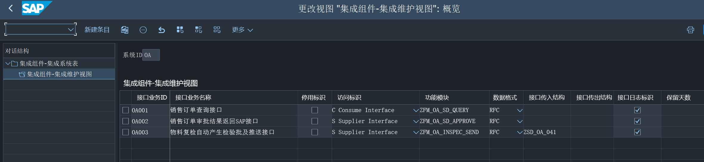
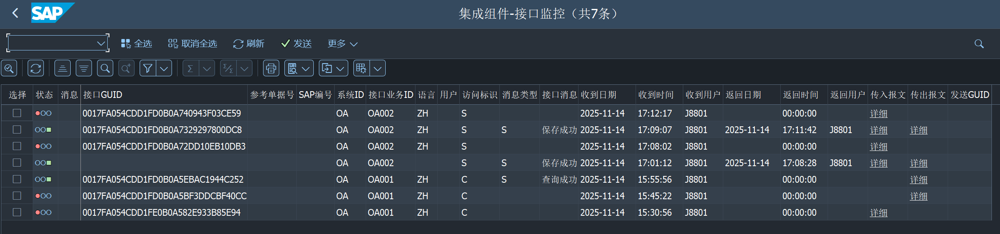

# SAP API 集成工具

## 项目介绍

欢迎来到 SAP API 集成工具的 GitHub 页面！本工具旨在帮助用户更便捷地集成 SAP 系统 API。通过本工具，您可以在 SAP 服务器上管理集成系统、处理集成业务逻辑、监控集成数据流，并在出现异常时向管理员发送通知。

> **注意**：当前版本的功能，仅表示现有需求所做功能，更多功能可以定制

## 功能模块

### 集成系统管理

* 用于配置和管理与 SAP 系统的连接。
* **状态**：**已完成**

### 集成业务管理

* 提供集成业务流程的定义与支持，包括接口消费、接口调用、工作流等。
* **状态**：已完成

支持接口类型：

* [X]  RFC 接口
* [X]  Web Servser 接口
* [X]  Restfull 接口
* [ ]  IDOC 集成
* [ ]  工作流 集成

支持报文格式：

* [X]  ABAP 结构
* [X]  XML 格式
* [X]  JSON 格式

### 集成数据监控

* 实现数据交换过程的实时监控。
* **状态**：已完成

### 接口异常通知

* 定义接口异常分类，当 API 调用出现严重问题时自动向管理员发送通知，需要集成到三方通讯软件或邮箱。
* **状态**：已完成

### 数据加密传输

* 内置常见加密工具，支持单项加密，对称加密和非对称加密，可对指定数据进行加密转换，或接口报文加密传输
* **状态**：已完成

支持加密类型：

* [X]  Base64
* [X]  MD5/SHA1
* [X]  DES/3DES/AES
* [X]  RSA

## 使用指南

使用配置表，配置集成系统信息

配置接口信息

监控接口情况

## 反馈与支持

如果您在探索或尝试使用我们的工具时遇到任何问题，或有任何建议和想法，欢迎通过 GitHub Issues 提出。我们会尽快回复，并尽力解决您的问题。

## 贡献

我们热烈欢迎您为本项目做出贡献。无论是报告 bug、提出改进建议，还是直接参与代码开发，您的每一份努力都将帮助我们打造更好的工具。

## 许可证

MIT 许可证

版权所有 (c) [2025] [MarkWu]

特此免费授予获得本软件及相关文档文件（以下简称“软件”）副本的任何人无限制地处理本软件，包括但不限于使用、复制、修改、合并、发布、分发、再授权及/或销售本软件副本，并允许向其提供本软件的人也这样做，但须符合以下条件：

上述版权声明和本许可声明应包含在本软件的所有副本或主要部分中。

本软件是“按原样”提供的，不附带任何明示或暗示的担保，包括但不限于对适销性、特定用途适用性及非侵权性的担保。在任何情况下，作者或版权持有人均不对因本软件或本软件的使用或其他交易而产生的任何索赔、损害或其他责任承担责任，无论是在合同诉讼、侵权或其他方面。

## 相关链接

- [Issues](https://github.com/MarkWuRY168/ABAP_API_TOOL/issues ) - 用于报告问题或请求新功能的地方。

感谢您对 SAP API 集成工具的关注
